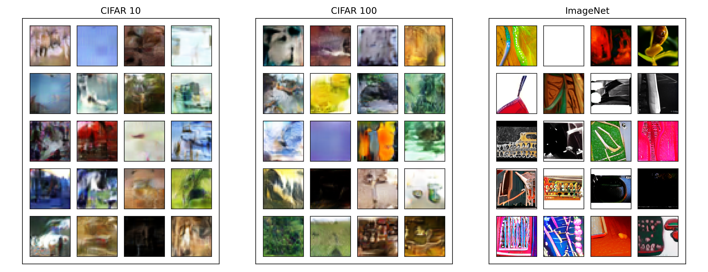
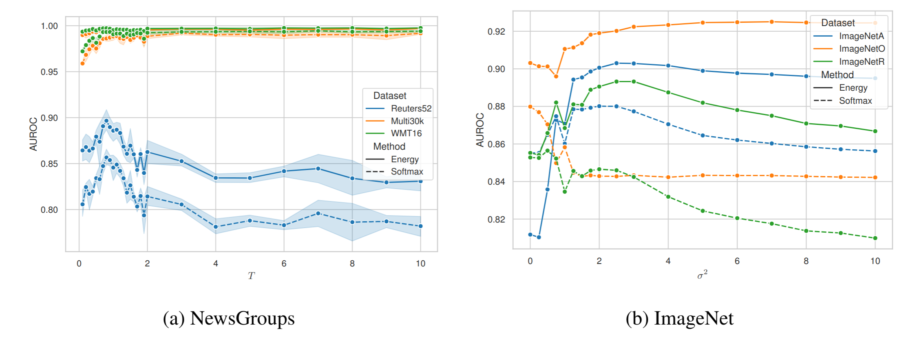

# On Outlier Exposure with Generative Models 

This is the code for the workshop paper *On Outlier Exposure with Generative Models* as published 
on the NeurIPS 2022 Machine Learning Safety Workshop. 

In the paper, we take a first step into exploring the idea of using generative models to sample from low density regions of the data 
distriubtion.
Such samples can be used as synthetic outliers for outlier exposure, and we show that they tend to make the model more robust to Out-of-Distribution data 
compared to models exposed to uniform noise. 

## Dependencies

* pytorch 
* torchvision
* torchtext
* pytorch-ood 

